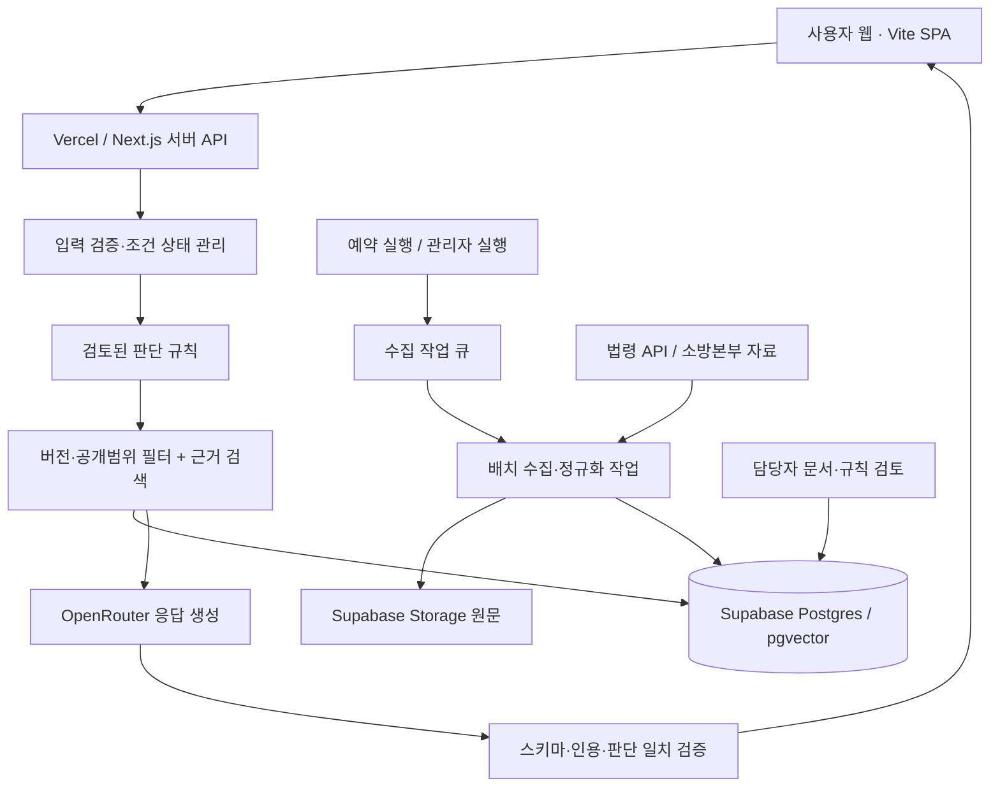

# 소방시설 법령 API 기반 AI 안내 챗봇 프로그램 기획서

작성일: 2026-09-17 · 버전: 0.2 · 상태: 구현 착수용 초안

0.2 개정 (2026-09-17): 구현된 프런트엔드에 맞춰 §1 전제표, §2.2 첫 화면, §3 시스템 구성과 §3.1, §8 화면 문단, §13 저장소 구조를 고쳤다. 기능 범위·법령 API·데이터 모델·검색·규칙·서버 API 계약은 그대로다.

0.3 개정 (2026-09-17): 미결이던 두 항목을 확정했다. 도면 패널은 1차 출시에서 제외하고(§2.2·§3.1), 사용자 인증은 Supabase Auth 소셜 로그인을 채택한다(§3). 법령 API 연결 시험 결과는 [법령 API PoC](docs/law-api-poc.md)에 있다.

0.4 개정 (2026-09-17): [OpenRouter PoC](docs/openrouter-poc.md) 결과 OpenRouter 가 임베딩을 제공하지 않음을 확인하고 §6.1·§9 의 전제를 고쳤다. 임베딩은 OpenAI `text-embedding-3-small`(1536차원)로 확정한다. 기본 챗 모델은 `anthropic/claude-haiku-4.5` 로 둔다(§6.4). 내부 자료의 외부 모델 전송을 허용하기로 결정해 §9 에 기록했다.

대상 독자: Vercel·Supabase 및 백엔드 개발 경험이 있는 개발자와 소방 업무 검토 담당자

## 1. 프로젝트 목표와 전제

소상공인이 건물과 영업장 정보를 입력하거나 질문하면, 국가법령정보 공동활용 API로 확보한 법령과 화재안전기준을 검색하고 관련 근거를 제시하는 챗봇을 구축한다. OpenRouter를 모델 호출 경로로 사용하고, Vercel에 웹·서버 API를 배포하며, Supabase에 문서·검색 인덱스·대화·검토 이력을 저장한다.

우선 근거 검색 챗봇을 완성하고, 담당자 검토가 끝난 범위에 한해 조건별 적용 판단을 추가한다. 두 기능의 출시 수준을 분리한다. 검색 챗봇이 있다는 이유만으로 모든 건물의 설치대상을 판정할 수 있다고 표시하지 않는다.

| 항목 | 현재 전제 |
|---|---|
| 사업 예산 | 총 20,000,000원. 부가세·운영비 포함 여부는 미확정 |
| 개발 환경 | 프런트엔드 Vite + TypeScript, 서버 Next.js + TypeScript, Vercel, Supabase, OpenRouter |
| 근거 공급 | 국가법령정보 API, 소방본부 제공 자료 |
| 초기 사용자 | 창업 예정 소상공인, 검토 담당자 |
| 최초 적용 사례 | 일반음식점으로 제안. 전체 업종 범위는 담당자 협의 후 확정 |
| 기간·인력 | 신청 폼에 입력되어 있던 2개월·1명을 일정 초안으로 사용. 확정된 수행 약정은 아님 |
| 현재 API 상태 | 공식 가이드 및 신청 폼 확인·편집까지 수행. 최종 저장·승인 및 인증 호출 성공은 확인하지 않음 |
| 실제 구현 상태 | 프런트엔드 화면 프로토타입이 `frontend/`에 구현됨(§3.1). 서버 API·DB·수집·배포는 미착수 |

완료 목표는 질문에 답을 생성하는 데 그치지 않고, 답변의 근거 문서·버전·조항과 판단 경로를 재현할 수 있는 프로그램이다.

## 2. 제품 범위

### 2.1 1차 제공 기능

1. 자연어 법령 질문 및 출처가 연결된 답변.
2. 건물·영업장 조건 입력과 수정, 부족한 정보에 대한 추가 질문.
3. 현행법령·NFPC·NFTC·별표·소방청 해석 검색.
4. 검토된 규칙에 한해 `해당 / 비해당 / 추가 확인 필요` 표시.
5. 답변 근거 카드에서 원문, 시행일, 조항·별표 위치 확인.
6. 관리자 수집 실행, 실패 재처리, 개정 차이 확인, 문서·규칙 게시 승인.
7. 모델 호출량·비용·검색 실패·사용자 오류 신고 확인.

### 2.2 후속 범위

전 업종 자동 판정, 도면 분석과 실별 기구 수량 산출, 건축물대장 자동 연계, 공적 증명서 발급, 복잡한 공사·용도변경 이력의 자동 법률 해석은 후속 범위로 둔다. 주소 입력만으로 건물 정보를 확보하는 API는 이번 법령 API와 별개다.

첫 화면은 단일 채팅 입력으로 시작한다. 질문을 그대로 받아 답변과 근거를 보여주고, 영업장 조건 확인은 대화 중 추가 질문으로 이어간다. 별도 진입점을 고르게 하지 않는다.

구현된 화면은 §3.1을 따른다. `내 영업장 기준 확인` 진입점과 조건 카드는 아직 없다. M5에서 우측 패널의 탭으로 붙인다.

## 3. 시스템 구성



웹 요청은 승인된 로컬 자료를 검색한다. 사용자 질문마다 법령 API를 대량 호출하지 않는다. 수집 작업은 대화 요청과 별도로 실행한다.

| 구성 | 선택 및 책임 |
|---|---|
| 프런트엔드 | Vite + TypeScript 단일 페이지 앱. 프레임워크 없음. 정적 빌드 산출물을 배포 |
| 서버 API | Next.js App Router의 Route Handlers, TypeScript |
| 배포 | Vercel. 일반 서버 코드는 Node.js 런타임 기준 |
| DB | Supabase Postgres. 관계·버전·상태·작업 큐 관리 |
| 파일 | Supabase Storage. 원문 JSON 및 별표·제공 문서 보관 |
| 검색 | 정확한 명칭/조항 조회 + pg_trgm 키워드 검색 + pgvector |
| 인증 | Supabase Auth 로 통일한다. 일반 사용자는 Google·카카오 소셜 로그인, 관리자는 동일 Auth 의 권한 구분. 비로그인 질문은 서명된 익명 세션으로 허용하고 로그인 시 대화를 계정으로 옮긴다 |
| 모델 | OpenRouter의 모델 ID를 환경변수로 지정. 임베딩 모델은 별도 설정 |
| 작업 실행 | 초기 대량 수집은 개발자 CLI, 운영 갱신은 작은 배치의 예약 작업 |

Vercel 함수 및 Cron에는 실행시간 제한이 있고, 실패한 Cron 호출을 자동 재시도하지 않는다고 안내한다. 따라서 한 번의 함수에서 전체 수집을 수행하지 않고 DB에 진행 상태를 남긴다. 프로세스 종료 뒤에도 작업이 계속된다고 가정하지 않는다. [S8]

### 3.1 프런트엔드 구현 현황

화면은 `frontend/`에 Vite + TypeScript로 구현되어 있다. React 등 프레임워크를 쓰지 않는다. 서버 API는 별도로 Next.js Route Handlers에 둔다. 프런트엔드는 정적 빌드 산출물이므로 서버 코드와 배포 단위를 분리한다.

**화면 구조**

좌우 3단 세로 레이아웃이다. 칸 사이 핸들을 드래그하거나 방향키로 폭을 조절하며, 폭은 `localStorage`에 남는다.

| 칸 | 내용 | 폭 |
|---|---|---|
| 좌 | 대화 목록, 계정 | 200~420px |
| 중 | 채팅, 입력창 | 남는 공간 |
| 우 | 검토 결과 패널 (도면 · 법령 · 체크리스트 탭) | 360~760px |

우측 패널은 검토 결과가 생길 때 열린다. 답변의 `도면에서 보기`, 헤더의 `도면 패널`, 법령 칩 클릭이 모두 이 패널을 연다. 화면 폭이 1080px 아래로 내려가면 사이드바가 숨고 패널이 화면을 덮는다.

**상태와 경계**

상태는 `src/lib/store.ts`의 구독형 저장소 하나에 모인다. 컴포넌트는 상태를 직접 고치지 않고 `src/actions.ts`의 `AppActions`만 호출한다. 도메인 타입은 `src/types.ts`에 둔다. 나중에 프레임워크를 도입하더라도 `types.ts`와 `actions.ts`는 그대로 쓴다.

**서버 연동 지점**

백엔드가 없으므로 아래 네 지점은 목 구현이다. 각각 대응하는 이슈가 붙기 전까지 화면 확인용 고정 데이터를 반환한다.

| 자리 | 지금 | 연결 대상 |
|---|---|---|
| `src/api/chat.ts` | 고정 답변 | `POST /api/chat`. 스트리밍 도입 시 반환 타입을 `AsyncIterable<string>`로 변경 |
| `src/auth/index.ts` | `MockAuthService` | 서명된 세션 발급. 토큰 검증은 반드시 서버에서 수행 |
| `src/data/review.ts` | 예시 법령 문구 | `GET /api/sources/:id` 근거 카드 |
| `src/data/plan.ts` | 고정 평면도 | 후속 범위. §2.2에 따라 1차 범위 밖 |

**디자인**

색·글자·간격·모서리 값은 `src/styles/tokens.css`의 CSS 변수로 관리하며 디자인 시스템과 같은 값을 가진다. 값을 바꿀 때는 디자인 시스템을 먼저 고친다. 다크 테마는 시스템 설정을 따르고 `<html data-theme>`로 고정할 수 있다.

**출시 범위 결정 (2026-09-17)**

구현이 §2.2를 앞서 나간 두 항목을 확정했다.

*도면 패널은 1차 출시에서 제외한다.* §2.2의 후속 범위 규정을 그대로 지킨다. 8주 일정과 2천만원 예산이 도면 분석을 포함하지 않는 전제였기 때문이다. 코드는 지우지 않고 `src/config.ts`의 `FEATURES.planPanel` 플래그로 가린다. 후속 범위를 열 때 이 값을 `true`로 되돌리면 도면 탭·첨부 버튼·`도면에서 보기` 액션이 함께 살아난다. 플래그가 꺼져 있으면 패널은 `법령` 탭으로 열린다.

*사용자 인증은 Supabase Auth 소셜 로그인을 채택한다.* Google·카카오를 Supabase Auth 로 붙여 관리자 인증과 같은 체계를 쓴다. 대화 기록이 계정에 남아 재방문 시 이어서 볼 수 있다. 비로그인 질문은 서명된 익명 세션으로 계속 허용하고, 로그인 시 익명 세션의 대화를 계정으로 옮긴다. 카카오는 별도 앱 등록이 필요하며 토큰 검증은 반드시 서버에서 수행한다. ISS-013의 범위가 OAuth 연동만큼 늘어난다.

## 4. 법령 API 수집 설계

### 4.1 초기 수집 목록

| 자료군 | 대상 | 우선순위 |
|---|---|---|
| 설치 법령 | 소방시설 설치 및 관리에 관한 법률·시행령·시행규칙 | P0 |
| 시설 기준 | 대상 시설의 화재안전성능기준(NFPC), 화재안전기술기준(NFTC) | P0 |
| 영업장 규정 | 다중이용업소의 안전관리에 관한 특별법·시행령·시행규칙 | P0 |
| 해석 | 소방청 법령해석 및 관련 법령해석례 | P1 |
| 내부 자료 | 담당자가 선정한 질의회신·업무 안내 | P1 |
| 관리 업무 | 화재의 예방 및 안전관리에 관한 법률과 하위 법령 | 안내 범위 확대 시 |
| 건축·지역 규정 | 관련 건축법령·전북 및 시군 자치법규 | 인용 관계와 사업 범위에 따라 추가 |

시행령 별표 2의 대상물 분류, 별표 4의 시설 종류, 별표 5의 면제 기준 및 부칙을 우선 구조화한다. NFPC·NFTC는 행정규칙으로 수집한다. 법령의 별표와 행정규칙의 첨부를 동일한 파서로 처리할 수 있다고 가정하지 않는다. [S9][S10]

### 4.2 API 계약

기본 호스트는 `https://www.law.go.kr/DRF`를 사용하고, 첫 연결 시험에서 HTTPS·JSON 응답과 권한을 확인한다. 인증값은 `OC` 요청변수로 전달한다. 아래 값은 예시이며 실제 키를 문서에 기록하지 않는다.

| 작업 | 경로 | 주요 요청값 |
|---|---|---|
| 현행법령 목록 | `/lawSearch.do` | `target=eflaw`, `type=JSON`, `nw=3`, `search=1`, `query`, `display=100`, `page` |
| 현행 본문 | `/lawService.do` | `target=eflaw`, `type=JSON`, `ID=법령ID` |
| 특정 버전 본문 | `/lawService.do` | `target=eflaw`, `type=JSON`, `MST=마스터번호`, `efYd=해당시행일` |
| 행정규칙 목록 | `/lawSearch.do` | `target=admrul`, `type=JSON`, `nw=1`, `query`, `display=100`, `page` |
| 행정규칙 본문 | `/lawService.do` | `target=admrul`, `type=JSON`, `ID=행정규칙일련번호` |
| 법령 별표 검색 | `/lawSearch.do` | `target=licbyl`, `type=JSON`, `query` |
| 행정규칙 별표 검색 | `/lawSearch.do` | `target=admbyl`, `type=JSON`, `query` |
| 소방청 해석 목록·본문 | 위 목록·본문 경로 | `target=nfaCgmExpc`, `type=JSON`; 본문은 `ID=해석일련번호` |

법령의 `nw=3`과 행정규칙의 `nw=1`은 모두 현행을 뜻하지만 값이 다르다. ID로 조회하는 법령 본문과 MST·시행일로 조회하는 본문을 구별한다. `efYd`에 단순히 오늘 날짜를 넣지 않는다. 목록에서 반환된 시행일과 상세 식별정보를 사용한다. [S1][S2][S3][S4][S5]

법령해석례·별표의 세부 계약은 해당 가이드로 별도 어댑터를 작성한다. 한 target의 필드·현행 구분값을 다른 target에 재사용하지 않는다.

### 4.3 최초 연결 시험

1. 신청 완료와 필요한 JSON·HTML 항목의 권한을 확인한다.
2. 개발 환경에서 법령 목록 한 건, 본문 한 건을 호출한다.
3. NFPC와 NFTC를 각각 조회하고 본문·첨부 제공 형태를 확인한다.
4. 시행령 별표 4의 텍스트와 원본 링크를 확보한다.
5. 소방청 해석 한 건의 질의요지·회답·이유를 확인한다.
6. Vercel Preview에서도 동일 시험을 수행한다. IP 등록이 필수인지, 실제 송신 IP 제약이 있는지 운영기관에 확인한다. 고정 IP가 요구될 때만 해당 연계 부분을 고정 송신 IP 환경으로 옮기는 대안을 검토한다.

응답 HTTP 코드뿐 아니라 Content-Type, 오류 본문, 결과 수, ID, 실제 본문 존재를 확인한다. HTTP 200으로 오류 HTML이 오는 경우도 성공으로 기록하지 않도록 방어한다. JSON 필드 형태는 샘플 응답을 저장하고 런타임 스키마로 검증한다.

### 4.4 수집 파이프라인

`목록 탐색 → 정확한 문서 선택 → 버전 본문 → 원문 저장 → 정규화 → 조항/별표 분해 → 검색 인덱스 → 검토 → 게시`

- 검색어는 최초 발견용이다. 제목에 소방이 포함됐다는 이유로 모든 결과를 승인하지 않는다.
- 선정 문서의 영구 ID와 관련 문서 관계를 수집 목록으로 관리한다.
- 페이지별 `totalCnt`와 수집 건수를 대조해 첫 페이지만 저장하는 누락을 방지한다.
- 문서 ID·버전·원문 해시로 중복을 막고, 내용이 같으면 재임베딩하지 않는다.
- 원문 본문에 제공되는 별표 다운로드 링크를 수집한다. 상대 링크는 공식 호스트를 기준으로 해석하고 다운로드 대상 호스트·파일 크기·형식을 제한한다. [S0]
- 임의의 글자 수보다 조문·항·호·기준 번호를 우선한다. 긴 항목을 나눌 때는 상위 제목과 적용 조건·비고를 각 조각에 연결한다.
- 표 추출이 불완전하면 `needs_review`로 표시하고 해당 항목을 자동 판단 근거로 게시하지 않는다.

### 4.5 개정과 적용 시점

현행, 시행예정, 연혁을 별도로 저장한다. 신규 버전이 발견되면 구버전을 덮어쓰지 않는다. 법령 시행일과 개별 건물에 대한 적용 시점은 별개이므로, 건축허가·용도변경 등 관련 사건 날짜와 부칙을 함께 검토한다. [S9]

새 버전 발견 시 문서와 연결된 규칙을 검토 대기로 전환한다. 이전 규칙을 최신 기준이라고 계속 보여주지 않는다. 일반 원문 조회는 새 버전 표시가 가능하되, 영향받은 자동 판정은 검토 완료 전 `추가 확인 필요`로 낮춘다. 법령 간 시행 구간을 일률적으로 추정하지 않고, 명시한 기준일과 문서 버전을 답변에 남긴다.

## 5. Supabase 데이터 모델

아래는 논리 설계이며 실행용 마이그레이션은 구현 단계에서 작성한다. UUID 내부 키와 원천의 문자열 ID를 분리한다. 법령ID와 법령 일련번호를 혼용하지 않는다.

| 테이블 | 핵심 필드·역할 |
|---|---|
| `legal_documents` | `id`, `source_type`, `source_document_id`, `title`, `issuer`, `document_kind` |
| `legal_versions` | `id`, `document_id`, `source_version_id`, `effective_date`, `promulgated_at`, `source_url`, `raw_path`, `content_hash`, `review_status`, `fetched_at` |
| `legal_units` | `id`, `version_id`, `unit_type`, `locator`, `parent_unit_id`, `heading`, `text`, `attachment_path`, `parse_status` |
| `search_chunks` | `id`, `unit_id`, `context_text`, `chunk_hash`, `embedding_model`, `embedding_revision`, `embedding vector(1536)`, `visibility` |
| `legal_relations` | `from_unit_id`, `to_document_id/to_unit_id`, `relation_type`, `review_status` |
| `source_files` | 내부 파일 출처, 분류, 공개 가능 범위, 게시 승인자. 공개 법령과 구분 |
| `rule_sets` | 규칙 버전, 적용 범위, 승인 상태, 승인자, 발행 시각 |
| `rules` | `rule_set_id`, 필요한 입력, 선언형 조건, 결과, 설명 템플릿 |
| `rule_sources` | `rule_id`, `legal_unit_id`, 근거 역할. 규칙과 특정 원문 버전 연결 |
| `building_cases` | 소유 세션/사용자, 입력값 JSONB, 확인 상태, 사건 날짜, revision |
| `chat_sessions`, `chat_messages` | 소유자, 질문·검증된 답변, 참조 case revision |
| `answer_runs` | 모델·프롬프트 버전, 사용 근거 ID, 규칙 버전, 입력 스냅샷, 토큰·비용·지연 |
| `ingestion_jobs` | 단계, cursor, 상태, attempts, `next_run_at`, lease, 마지막 오류 |
| `review_events`, `feedback` | 승인·반려 이력, 사용자 오류 신고, 처리 상태 |

권장 제약: `(source_type, source_document_id)` 고유, `(document_id, source_version_id, effective_date)` 등 원천 버전 특성에 맞춘 고유 제약, 버전별 locator 고유. 규칙 근거·답변 인용은 외래키로 무결성을 보장한다. 버전 식별자가 없는 내부 파일은 content hash 기반 revision을 사용한다.

`search_chunks.embedding` 은 `vector(1536)` 이다. pgvector 는 차원을 컬럼 타입에 고정하므로 임베딩 모델 변경은 컬럼·인덱스 재생성과 전체 재임베딩을 뜻한다(§6.1).

원문·공개용 데이터와 운영·대화 데이터를 schema 또는 권한으로 분리한다. 초기 일반 사용자 요청은 서버에서 처리하고 DB에 직접 쓰지 않는다. Supabase secret 키는 RLS를 우회하므로 서버 경로 자체에서 소유권과 관리자 권한을 검사한다. 브라우저에 노출되는 테이블은 grants와 RLS를 함께 설정한다. 내부 자료는 검색 RPC에서도 공개 가능 범위를 강제한다. [S7]

## 6. 검색과 챗봇 처리

### 6.1 검색 전략

1. 정확한 법령명·NFPC/NFTC 코드·조항 번호를 먼저 해석한다.
2. 질문 의도, 건물 용도, 시설 종류, 기준일, 공개 가능 범위로 후보를 제한한다.
3. 명칭·코드 일치, 한국어 키워드 유사도, 벡터 유사도를 결합한다.
4. 검색 결과를 RRF 방식 등으로 합치고 상위 후보를 좁힌다.
5. 선택한 항목의 상위 문맥·비고·연결된 예외 조항을 함께 가져온다.
6. 근거가 부족하거나 기준일이 불명확하면 확답 대신 추가 질문을 생성한다.

Supabase는 전문 검색과 벡터 검색을 결합하는 예제를 제공한다. 다만 한국어 법률 검색에 영어용 전문 검색 설정을 그대로 적용하지 않는다. 초기에는 정확 일치·pg_trgm·다국어 임베딩을 비교 평가하고, 형태소 분석 도입은 검색 평가 결과로 결정한다. 후보 수 30, 최종 근거 6~10개는 튜닝 시작값이다. [S6]

임베딩은 **OpenAI `text-embedding-3-small`** 을 사용한다. 1536차원, 입력 상한 8,192토큰, 100만 토큰당 $0.02 다(2026-09-17 확인). 챗 모델과 달리 OpenRouter 를 경유하지 않고 OpenAI API 를 직접 호출한다. **OpenRouter 는 임베딩 모델을 제공하지 않는다** — 444개 모델 전부 chat completions 전용임을 확인했다. [S12]

이 프로젝트 규모에서 임베딩 비용은 결정 요인이 아니다. 수집 대상 전체를 500만 토큰으로 넉넉히 잡아도 $0.10 수준이다. 선택 기준은 한국어 법령 검색 품질이며, ISS-012 의 담당자 검토 평가셋으로 후보를 비교해 확정한다. 지금 값은 착수용 기본값이다.

질의와 문서에 반드시 같은 모델·차원을 사용한다. 모델이 다르면 좌표계가 달라 거리 계산이 무의미하다. `search_chunks` 에 `embedding_model` 과 `embedding_revision` 을 저장하고 질의 시 불일치를 차단한다.

pgvector 컬럼은 차원을 타입에 고정하므로(`vector(1536)`) 모델 변경은 컬럼·인덱스 재생성과 전체 재임베딩을 뜻한다. 모델을 바꿀 때는 새 인덱스를 만든 뒤 전환하고, 복귀 경로를 함께 남긴다.

### 6.2 한 턴의 처리

`요청 인증·한도 → 입력 스키마 검증 → 필요 시 조건 추출 → 사용자 확인 → 규칙 실행 → 근거 검색 → OpenRouter 생성 → 검증 → 표시·기록`

- 법령 일반 질문에는 불필요한 건물 입력을 강제하지 않는다.
- 자연어에서 추출한 면적·층·용도는 출처 메시지와 함께 후보값으로 저장한다. 애매한 값은 확정하지 않는다.
- 조건이 달라지면 case revision을 증가시키고 기존 판단 캐시를 무효화한다.
- 규칙이 없는 범위는 근거 검색 답변으로 제공하며 판정 완료처럼 표시하지 않는다.
- `비해당`은 검토된 규칙이 명확히 충족할 때만 나온다. 검색 결과가 없다는 이유로 비해당을 만들지 않는다.

### 6.3 OpenRouter 호출 계약

서버에서 `POST https://openrouter.ai/api/v1/chat/completions`를 호출하고 `Authorization: Bearer ...`를 보낸다. 모델 ID를 명시하고, JSON Schema 응답을 지원하는 모델·provider만 허용한다. `provider.require_parameters=true`를 사용하되 실제 모델 지원 여부와 결과를 검증한다. [S11][S13]

LLM에는 질문, 확인된 건물 조건, 규칙 결과, 허용된 근거 ID와 본문만 전달한다. DB 쓰기나 임의 웹 검색 권한은 부여하지 않는다. 법령 원문·내부 파일·사용자 입력의 지시문은 시스템 지시로 해석하지 않는다.

응답 계약 예시:

```typescript
type ChatAnswer = {
  mode: 'legal_search' | 'case_guidance';
  summary: string;
  statements: Array<{ text: string; sourceIds: string[] }>;
  followUpQuestions: Array<{ field: string; question: string }>;
  limitations: string[];
};

// 서버가 결합하는 정보. LLM이 새로 판정하거나 URL을 작성하지 않는다.
type AnswerEnvelope = {
  answer: ChatAnswer;
  assessment: Array<{
    facility: string;
    status: 'applicable' | 'not_applicable' | 'needs_review';
    ruleId: string;
    sourceIds: string[];
  }>;
  sources: Array<{
    id: string; title: string; locator: string;
    effectiveDate: string | null; url: string;
  }>;
  caseRevision: number | null;
  corpusVersion: string;
};
```

Zod 등으로 구조를 검증하고, 인용 ID가 실제 검색 결과에 속하는지 확인한다. URL은 DB에서 조립한다. 인용 ID의 존재만으로 문장과 근거의 의미 일치가 보장되지는 않는다. 시설 적용 결론·숫자·조건은 규칙 템플릿으로 표시하고, 자유 설명의 근거 충실성은 평가 데이터로 검증한다.

검증 실패 시 제한된 재시도 1회 후 근거 목록과 추가 확인 안내를 반환한다. 출력 JSON에 검증되지 않은 원문 토큰을 바로 노출하지 않는다. 1차 UX는 SSE로 `검색 중 / 설명 작성 중` 상태만 보내고 검증된 최종 답변을 전달한다. 실제 토큰 스트리밍은 검증 전 노출 문제를 해결한 뒤 확장한다.

### 6.4 모델 선택과 장애 처리

기본 모델은 **`anthropic/claude-haiku-4.5`** 로 둔다. [OpenRouter PoC](docs/openrouter-poc.md)에서 후보를 비교한 결과다. 질문당 약 $0.0071 이며 월 10,000회 기준 $71 수준이다(2026-09-17 확인).

값싼 후보를 기본 모델로 쓰지 않는다. `google/gemini-2.5-flash-lite` 는 근거 본문에 심은 지시문을 명령으로 따랐고(프롬프트 인젝션), 존재하지 않는 조항을 있는 것처럼 제시했다. **두 경우 모두 인용 ID 는 유효했으므로 §6.3 의 ID 검증으로는 걸러지지 않는다.** 대체 모델 후보 `google/gemini-3.1-flash-lite` 는 아직 같은 시험을 거치지 않았다.

허용 모델 목록에는 이 시험을 통과한 모델만 넣는다. `/api/v1/models` 의 `supported_parameters` 표시를 근거로 넣지 않는다. `provider.require_parameters=true` 를 붙이면 OpenAI 계열은 조건을 만족하는 provider endpoint 가 없어 전면 차단된다.

모델별 토큰 수가 크게 다르다. 같은 프롬프트에 입력 토큰이 2,558 대 4,649 였다. 비용 산식에 단가만 쓰고 토큰 수를 모델별로 구분하지 않으면 틀린다.

429·5xx는 제한된 지수 백오프로 재시도한다. 인증 오류·잔액 부족은 반복 호출하지 않고 운영 오류로 분류한다. 실패 시 새 결론을 추정하지 않고 확보된 원문 근거를 보여준다. 요청별 토큰 상한, 세션별 횟수 제한, 일일 비용 예산을 서버에서 집행한다.

## 7. 건물 조건과 규칙 설계

| 입력군 | 초기 수집 항목 |
|---|---|
| 영업장 | 업종, 면적과 단위, 해당 층, 지하 여부, 출입구·복층 여부 |
| 건물 전체 | 건축물 용도, 연면적, 지상·지하 층수, 층별 용도와 면적 |
| 적용 시점 | 신축/기존/용도변경 여부, 필요한 허가·신고 날짜 |
| 추가 조건 | 기존 설비, 구획, 수용인원 등 선택된 규칙에 필요한 항목 |

각 필드는 `unknown / extracted / user_confirmed` 상태를 가진다. 최초부터 전 항목을 요구하지 않고 관련 규칙이 요구하는 것만 추가로 묻는다. 필수 여부는 소방 담당자가 검토한 판단표에서 정한다.

규칙은 버전 관리 가능한 선언형 JSON 또는 TypeScript 모듈로 시작한다. 임의 문자열 `eval`은 사용하지 않는다. 규칙 결과에는 검사한 입력, 미확인 조건, 예외 검사 결과, 근거 조항, 검토자, 규칙 버전을 포함한다. 관리자 범용 규칙 편집기는 1차 범위에서 제외하고 승인 화면만 제공한다.

## 8. 서버 API와 화면

| 경로 | 책임 |
|---|---|
| `POST /api/chat` | 소유권·요청한도 검증, 검색·생성·검증, SSE 응답 |
| `POST /api/cases` | 영업장 사례 생성 |
| `PATCH /api/cases/:id` | 확인된 조건 갱신, revision 관리 |
| `GET /api/sources/:id` | 접근 가능한 근거와 해당 버전 제공 |
| `POST /api/feedback` | 답변 오류 신고 |
| `POST /api/admin/ingestion` | 수집 작업 등록; 즉시 전체 작업을 수행하지 않음 |
| `GET /api/admin/ingestion/:id` | 작업 진행·실패 항목 조회 |
| `POST /api/admin/reviews/:id` | 관리자 승인/반려 및 감사 로그 |
| `GET /api/cron/ingestion` | Cron 인증 후 실행 예산 안에서 대기 작업 처리 |

사용자 화면은 대화 목록, 채팅, 우측 검토 패널의 3단 구조다(§3.1). 근거 카드는 패널의 `법령` 탭, 시설 적용 결과는 `체크리스트` 탭에 두어 AI 본문과 분리한다. 건물 조건 카드와 추가 질문, 오류 신고는 아직 없으며 M4~M5에서 붙인다. 관리자 화면은 수집 현황, 문서 비교, 규칙 영향, 승인 대기, 답변 추적으로 구성하며 미착수다.

API 스키마는 입력 길이, 페이지 크기, 허용 enum, 세션 소유권을 검증한다. `clientRequestId`를 세션별 고유 키로 저장해 중복 생성과 중복 과금을 줄인다. 케이스 수정 충돌은 revision 조건으로 감지한다.

## 9. 환경변수·운영 정책

```dotenv
# 예시 이름. 실제 비밀값을 저장소나 브라우저 번들에 넣지 않는다.
LAW_API_OC=
OPENROUTER_API_KEY=
OPENROUTER_CHAT_MODEL=
OPENROUTER_FALLBACK_MODEL=

# 임베딩은 OpenRouter 를 경유하지 않고 OpenAI 를 직접 호출한다. §6.1 참고.
OPENAI_API_KEY=
EMBEDDING_MODEL=
EMBEDDING_DIMENSIONS=
NEXT_PUBLIC_SUPABASE_URL=
NEXT_PUBLIC_SUPABASE_PUBLISHABLE_KEY=
SUPABASE_SECRET_KEY=
CRON_SECRET=
SESSION_SIGNING_SECRET=
APP_URL=
```

개발·Preview·운영 프로젝트와 키를 분리한다. DB 연결을 직접 사용할 경우 서버리스에 맞는 풀링을 설정한다.

비밀값 제거는 나가는 로그만으로 부족하다. 법령 API 는 **목록 응답의 `*상세링크` 필드에 `OC` 를 그대로 담아 돌려준다.** 5개 target 전부 해당한다([법령 API PoC](docs/law-api-poc.md)). 이 값을 그대로 저장하면 DB 에 키가 남고, 근거 카드로 내려가거나 모델 프롬프트에 들어가면 외부로 나간다. 따라서 세 곳에서 모두 제거한다.

1. 나가는 요청 로그의 `OC` 와 `Authorization` 헤더
2. **수집 시점** — 응답에서 받은 링크 필드를 저장 전에 치환한다
3. 사용자·모델에 전달하는 URL 은 §6.3 대로 서버가 DB 값으로 다시 조립한다

작업 큐는 원자적인 claim과 lease 만료, 재시도 횟수, 재시도 예정일을 사용한다. 실행시간 예산 전에 종료하고 cursor를 저장한다. 새 작업이 기존 작업과 중복 실행돼도 동일 버전이 중복 게시되지 않도록 한다.

대화·원문 저장기간과 공공기관의 배포 환경 요구사항은 운영 전 확정한다. 내부 자료의 **공개 승인**과 **외부 모델 전송 승인**은 계속 별도로 관리한다. 전자는 검색 결과·근거 카드에 노출할 수 있는지, 후자는 외부 API 로 본문을 보낼 수 있는지이며 서로 다른 판단이다.

### 외부 모델 전송 결정 (2026-09-17) · 개발 단계 한정

외부 모델·임베딩 API 로의 전송을 **개발 단계에 한해 허용한다.** 전송 대상은 OpenRouter(챗)와 OpenAI(임베딩)다.

| 항목 | 내용 |
|---|---|
| 승인 주체 | 개발 단계 판단 (담당자 승인 아님) |
| 승인 범위 | 공개 법령과 비식별 테스트 사례에 한함 |
| 결정일 | 2026-09-17 |
| 운영 전 조치 | **담당자 재승인 필요.** §14 및 ISS-029 에서 확정한다 |

이 결정이 바꾸는 것은 **기술 선택지**다. §6.1 의 임베딩 공급자 선택에서 외부 전송 제약이 빠져, 데이터가 나가지 않는 선택지(Supabase Edge Function 내장 모델 등)를 강제할 이유가 없어졌다.

이 결정이 바꾸지 않는 것:

- **실제 소방본부 내부 자료는 담당자 승인 전까지 투입하지 않는다.** 개발은 공개 법령과 비식별 테스트 사례로 진행한다. 내부 자료 기능은 비식별 fixture 로 검증하고 미투입 상태를 기록한다(ISS-024).
- **공개 승인과 외부 전송 승인은 계속 분리한다.** 외부 모델에 보낼 수 있다는 것이 사용자에게 노출해도 된다는 뜻은 아니다. `source_files` 의 공개 범위와 `search_chunks.visibility` 는 그대로 강제한다.
- 개별 자료의 전송 가부는 자료별 승인 상태로 계속 관리한다.

운영 배포 전에 담당자가 전송 범위를 승인하지 않으면 내부 자료를 제외한 범위로 출시한다.

## 10. 검증과 검수 기준

아래 수치는 초기 목표이며 담당자와 조정한다. 법률적 정확도를 통계 수치 하나로 보장한다고 표현하지 않는다.

| 검증 영역 | 1차 완료 조건 |
|---|---|
| 수집 | 선정 목록의 본문·부칙·필수 별표 모두 수집, 오류/빈 본문 구별 |
| 버전 | 현행·시행예정 혼용 없음, 이전 답변의 원문 버전 재조회 가능 |
| 검색 | 담당자 작성 질문 50건 이상에서 필수 근거 Recall@10 목표 90% 이상 |
| 규칙 | 지원 범위의 경계값·예외·입력 누락 사례 전부 기대 결과 일치 |
| 인용 | 존재하지 않거나 접근 불가한 근거 링크 노출 0건 |
| 답변 | 검수 사례의 핵심 적용 결론이 규칙과 충돌하는 사례 0건 |
| 정보 부족 | 면적·용도·시점 부족 사례에서 임의 확정하지 않고 추가 질문 |
| 권한 | 다른 세션 대화·내부 문서·관리자 API에 대한 접근 차단 |
| 복구 | 429, 인증 실패, 잘못된 JSON, 수집 중단, 모델 실패의 대응 확인 |
| 성능 | 측정 환경에서 최종 답변 p95 20초 이내를 초기 목표로 관리 |

실제 API 응답 fixture 기반 계약 테스트, 문서 파서 테스트, 규칙 경계값 테스트, 검색 평가, 소수 핵심 E2E를 구성한다. 소방 담당자 검토가 필요한 정답은 개발자가 단독으로 확정하지 않는다.

## 11. 8주 구현 순서

| 기간 | 산출물 | 완료 기준 |
|---|---|---|
| 1주 | 권한·API·모델 연결 시험, 수집 목록, DB 초안 | 법령·NFPC·NFTC·별표 각각 원문 확보, 모델 JSON 응답 성공 |
| 2주 | 수집 CLI, 원문 저장, 정규화·버전 모델 | 초기 문서 묶음 수집 및 재실행 중복 방지 |
| 3주 | 검색 인덱스, 근거 조회 API | 평가 질문으로 검색 실패 유형 확인 |
| 4주 | 근거 검색 챗봇, 검증된 최종 답변 | 질문→검색→인용 답변의 수직 흐름 완성 |
| 5주 | 일반음식점 입력·추가 질문·검토된 규칙 | 담당자 선정 사례에 대한 결과 재현 |
| 6주 | 관리자 검토, 개정 감지, 예약 갱신 | 새 버전 발견→영향 규칙 검토 흐름 완성 |
| 7주 | 권한·비용·실패 복구·검색 및 규칙 검증 | 검수 목록 통과, 주요 결함 수정 |
| 8주 | 운영 배포·인수인계·최종 검수 | 운영 설정, 복구 절차, 담당자 사용 설명 완료 |

1인 개발 기준으로 규칙 범위와 자료 품질이 일정에 가장 크게 영향을 준다. 4주차 검색 챗봇을 첫 검토 지점으로 삼는다. 담당자 판단표 검토가 늦어지면 검색 기능을 먼저 완성하고 미승인 판정은 공개하지 않는다.

## 12. 예산과 운영비 관리

아래는 총액 내 작업 배분안이며 외부 서비스 견적이나 고정 가격이 아니다.

| 작업 | 배분 |
|---|---:|
| 요구사항·수집 범위·판단표 설계 | 3,000,000원 |
| API 수집·문서 정규화·검색 DB | 4,000,000원 |
| OpenRouter 챗봇·근거 검증 | 3,500,000원 |
| 건물 조건·추가 질문·규칙 구현 | 3,500,000원 |
| 사용자·관리자 화면 | 3,000,000원 |
| 테스트·배포·인수인계 | 2,000,000원 |
| 예비비 | 1,000,000원 |
| 합계 | 20,000,000원 |

부가세·클라우드 운영비가 총액에 포함된다면 그 금액을 먼저 유보하고 개발 범위를 조정한다. 실제 월비용은 Vercel·Supabase 요금제, DB·스토리지·트래픽, 모델별 입력/출력 토큰, 임베딩량을 합산한다. 확인하지 않은 현재 요금을 기입하지 않는다.

`월 모델비 = Σ(입력토큰/1M × 입력단가 + 출력토큰/1M × 출력단가) + 임베딩비`

PoC에서 100개 질문의 평균·p95 토큰과 비용을 측정한 뒤 월 1,000/10,000/50,000회 시나리오로 환산한다. 대화가 길어질수록 늘어나는 문맥과 재시도 비용도 포함한다. 비용 상한과 경보 기준은 운영 설정으로 둔다.

## 13. 저장소 구조 제안

```text
frontend/                # 사용자 화면 (Vite + TypeScript SPA)
  src/main.ts            # 상태 생성, 컴포넌트 연결, 액션 정의
  src/actions.ts         # 화면 → 앱 방향의 통로 (AppActions)
  src/types.ts           # 도메인 타입
  src/api/               # 서버 API 호출 지점
  src/auth/              # 세션 연동 지점
  src/components/        # 사이드바·헤더·메시지·입력창·패널·로그인·리사이저
  src/lib/               # DOM 유틸, 상태 저장소, 아이콘
  src/styles/            # tokens · base · layout · components
  src/data/              # 연동 전 화면 확인용 고정 데이터

src/app/                 # 관리자 화면과 Route Handlers
src/lib/law-api/         # target별 요청·응답 어댑터
src/lib/ingestion/       # 원문 저장·정규화·작업 단계
src/lib/retrieval/       # 필터·키워드·벡터·근거 확장
src/lib/rules/           # 버전별 선언형 규칙 및 실행기
src/lib/chat/            # OpenRouter·프롬프트·검증
src/lib/auth/            # 세션·관리자·권한 검사
supabase/migrations/     # 스키마·인덱스·RLS·RPC
scripts/                 # 수집 CLI·평가·관리 스크립트
tests/fixtures/          # 비식별 API 샘플
evals/                   # 질문·정답 근거·판단 사례
docs/                    # 운영·수집·검수 문서
```

## 14. 착수 전에 확정할 항목

1. ~~법령 API 신청 저장·권한과 실제 호출 가능 여부.~~ 확인 완료 — [법령 API PoC](docs/law-api-poc.md)
2. ~~OpenRouter 키의 개발 환경 등록, 모델 후보.~~ 확인 완료 — [OpenRouter PoC](docs/openrouter-poc.md). 사용 한도 초안은 ISS-026 에서 작성한다.
3. 일반음식점으로 시작할지 및 처음 지원할 시설의 목록.
4. 소방 판단표와 정답 사례를 검토할 담당자·검토 일정.
5. 제공 자료 형식·수량·공개 가능 범위·외부 모델 전달 가능 범위. **외부 전송은 §9 에서 개발 단계에 한해 허용했으며 운영 전 담당자 재승인이 필요하다.**
6. Vercel/Supabase 프로젝트 소유 계정, 운영 도메인, 기관 배포 요구사항.
7. 부가세·운영비 포함 여부 및 유지보수 범위.

결정되지 않은 항목이 있어도 공개 법령을 대상으로 수집·검색 PoC는 진행할 수 있다. 첫 개발 작업인 법령·NFPC·NFTC·별표의 실제 응답 확보는 완료했다(§4.3, [PoC 결과](docs/law-api-poc.md)). 다음은 한 질문에 올바른 근거를 반환하는 수직 기능을 만드는 것이다.

## 15. 공식 참고자료

아래 자료는 2026-09-17에 확인했다. 파라미터·요금·지원 모델·플랫폼 제한은 구현 시 다시 확인한다.

- [S0 국가법령정보 OPEN API 활용방법](https://open.law.go.kr/LSO/openApi/openApiManual.do)
- [S1 현행법령 시행일 목록](https://open.law.go.kr/LSO/openApi/guideResult.do?htmlName=lsEfYdListGuide)
- [S2 현행법령 시행일 본문](https://open.law.go.kr/LSO/openApi/guideResult.do?htmlName=lsEfYdInfoGuide)
- [S3 행정규칙 목록](https://open.law.go.kr/LSO/openApi/guideResult.do?htmlName=admrulListGuide)
- [S4 행정규칙 본문](https://open.law.go.kr/LSO/openApi/guideResult.do?htmlName=admrulInfoGuide)
- [S5 소방청 법령해석 본문](https://open.law.go.kr/LSO/openApi/guideResult.do?htmlName=cgmExpcNfaInfoGuide)
- [S6 Supabase Hybrid search](https://supabase.com/docs/guides/ai/hybrid-search)
- [S7 Supabase Row Level Security](https://supabase.com/docs/guides/database/postgres/row-level-security)
- [S8 Vercel Managing Cron Jobs](https://vercel.com/docs/cron-jobs/manage-cron-jobs)
- [S9 소방시설 설치 및 관리에 관한 법률 시행령](https://www.law.go.kr/lsInfoP.do?lsId=009694)
- [S10 화재안전기술기준 NFTC 103 등록 사례](https://www.law.go.kr/LSW/admRulInfoP.do?admRulSeq=2100000281674&chrClsCd=010201)
- [S11 OpenRouter API Reference](https://openrouter.ai/docs/api_reference/overview)
- [S12 OpenAI Embeddings](https://developers.openai.com/api/docs/guides/embeddings) · OpenRouter 는 임베딩을 제공하지 않는다(§6.1)
- [S13 OpenRouter Structured Outputs](https://openrouter.ai/docs/guides/features/structured-outputs)
- [법령 별표·서식 목록](https://open.law.go.kr/LSO/openApi/guideResult.do?htmlName=lsBylListGuide)
- [행정규칙 별표·서식 목록](https://open.law.go.kr/LSO/openApi/guideResult.do?htmlName=admrulBylListGuide)
- [전체 API 가이드](https://open.law.go.kr/LSO/openApi/guideList.do)
